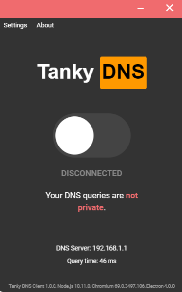
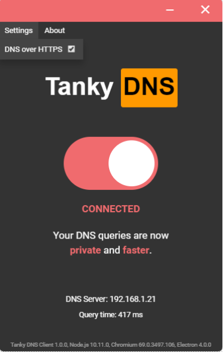

# Tanky DNS Client based Google DNS and Cloudflare DoH

## Installation and Use
#### Requirements
* Windows 7 or later.
* An Intel Pentium 4 processor or later that's SSE2 capable
* 512 MB of RAM

To clone and run this repository you'll need [Git](https://git-scm.com) and [Node.js](https://nodejs.org/en/download/) (which comes with [npm](http://npmjs.com)) installed on your computer. From your command line:

1. Clone the repo and install npm
```bash
# Clone this repository
https://github.com/khanghy3004/Google-DNS-Client
# Go into the repository
cd Google-DNS-Client
# Install dependencies
npm install
# Run the app
npm start
```

2. Then, give Node.js elevated privlages (UAC Administrator). This is required as much of the backend work involved in changing DNS addresses involves using Windows Shell. (Shown below)


3. DoH Server
Open Settings, enable DoH Server. We integrate a DNS-to-HTTPS proxy into the app and run it in the background 



## How it works
It's actually really simple, enabling 8.8.8.8 is done through this command
```bash
wmic nicconfig where (IPEnabled=TRUE) call SetDNSServerSearchOrder ("8.8.8.8")
```

And it's disabled again using this command
```bash
wmic nicconfig where (IPEnabled=TRUE) call SetDNSServerSearchOrder ()
```

And apart from a few checks I've built in inbetween, that's about all that glorified switch in the middle is doing.
